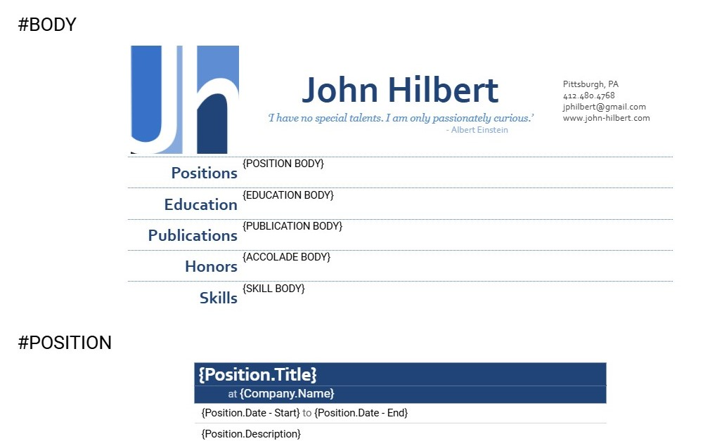
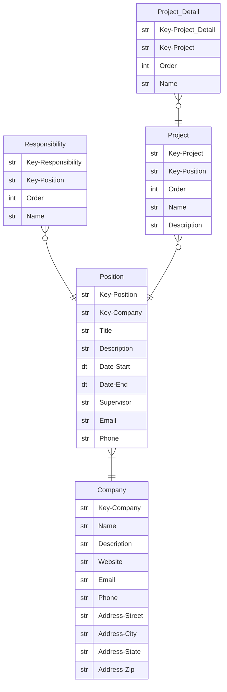
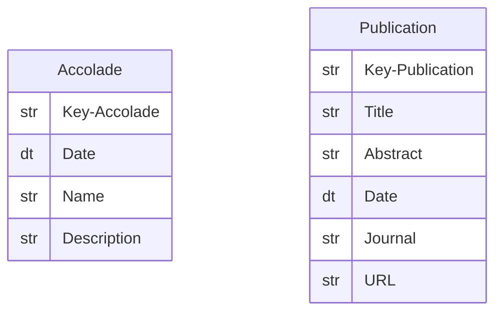
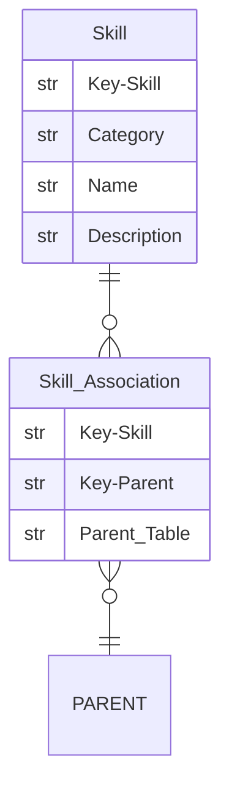

# Resume Automation
This repository houses automation scripts to create and format my resume however its just data so it could be anyone's resume.

- [Google Document Generation](#GoogleDocument-Generation)
- [Data](#Data)
	- [Education](#Education)
	- [Experience](#Experience)
    - [Accolades and Publications](#Accolades-and-Publications)
    - [Skills](#Skills)


# Google Document Generation
The Google Scripts [main.gs](main.gs) and [build_functions.gs](build_functions.gs) should be attached to a template file with a body and other elements 

A few fuctions are added to the menu of the template to facilitate merging it with with the data to produce a [complete resume](Resume%20(Basic).pdf).


# Data
The data is currently stored in a single Google Sheet, however it can be easily be switched to multiple CSV tables. As for nomenclature and standards, this is what I choose:

- Keys begin with `Key` and end with a table name
- Primary keys will be the first column followed by foreign keys
- Dates and address fields will begin with `Date` and `Address`
- Plural forms aren't use since it complicated things
- Capitalization and white spaces are used simply for readability


## Education 
```mermaid
erDiagram
Education }|--|| School : ""
Education ||--o{ Class : ""
Education { 
  str  Key-Education
  str  Key-School
  dt   Date-Start
  dt   Date-End
  str  Concentration
  str  Degree
  dt   Date-Degree
  num  GPA
}

School {
  str  Key-School
  str  Name
  str  Type
  str  Address-City
  str  Address-State
}

Class {
  str  Key-Class
  str  Key-Education
  str  Code
  str  Title
  str  Description
  dt   Date
  num  Units
  str  Grade
}
```

## Experience


## Accolades and Publications
These tables are pretty similar and have their own section in a resume.


## Skills
For the most part, skills are simply a categorized list. I have added another table for future use that connects a skill to another element in any other table.

